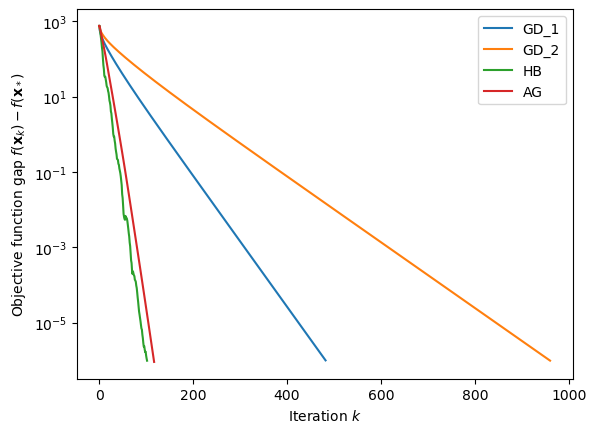
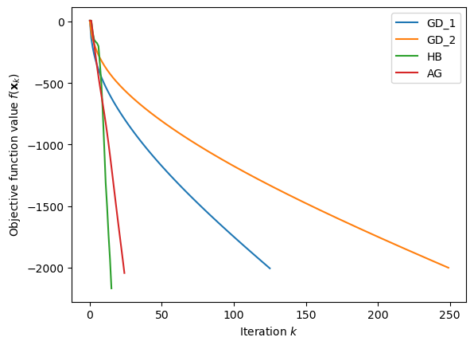
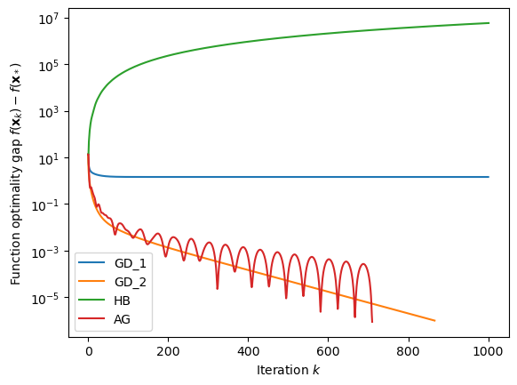
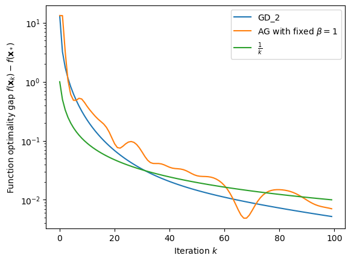
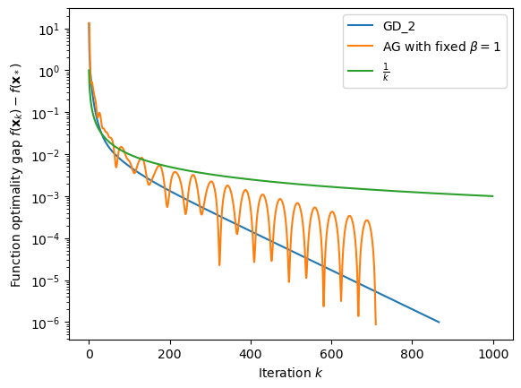
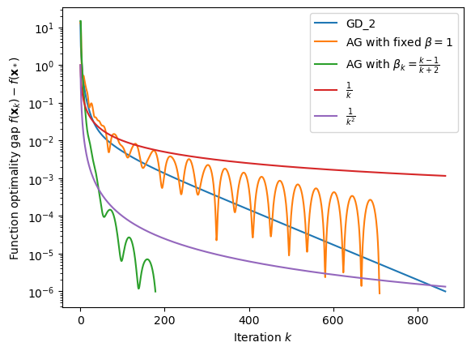
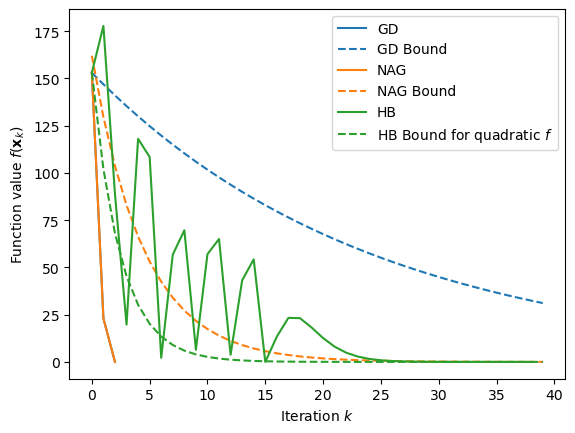
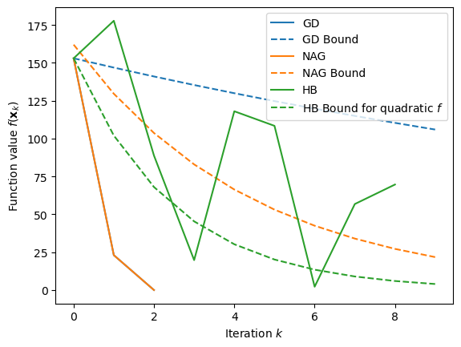
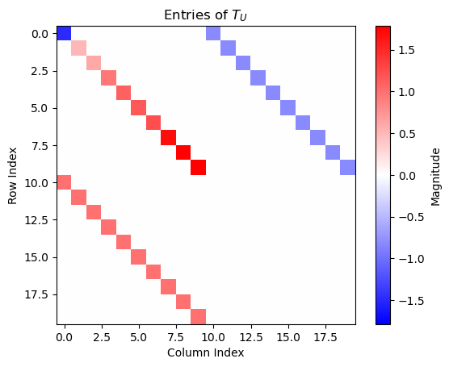
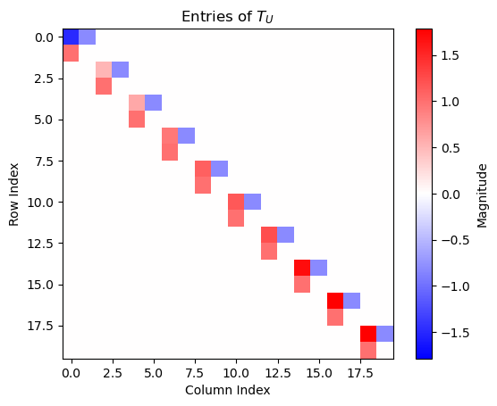

# Accelerated Gradient Methods: Momentum, Nesterov, and When Theory Misbehaves

This project implements and studies **first-order optimization methods with acceleration/momentum** on controlled test problems where you can see both:

- the **textbook behavior** (strongly convex quadratics), and
- the **real behavior** (weak convexity / non-strong convexity, and piecewise-defined objectives).

Core methods included:

- **Gradient Descent (GD)** with classic fixed stepsizes
- **Heavy-Ball (HB)** momentum
- **Nesterov’s Accelerated Gradient (NAG)**
- Nesterov acceleration with the **general convex** schedule $\beta_k = \frac{k-1}{k+2}$

The repository produces a compact set of plots comparing convergence, iteration counts, and (when applicable) worst-case bounds.

---

## Install

```bash
python -m venv .venv
# Linux/Mac
source .venv/bin/activate
# Windows (PowerShell)
.venv\Scripts\Activate.ps1

pip install -r requirements.txt
```

---

## Main math formulas

> **Note on rendering:** GitHub math can be picky when display equations are indented or placed inside lists/HTML blocks.  
> To make rendering consistent, all display equations below use fenced `math` blocks (instead of `$$ ... $$`).

### Gradient Descent (GD)

For differentiable $f:\mathbb{R}^n \to \mathbb{R}$:

```math
x_{k+1} = x_k - \alpha \nabla f(x_k).
```

Two common fixed stepsizes for $L$-smooth, $\mu$-strongly convex objectives:

```math
\alpha=\frac{1}{L},
\qquad
\alpha=\frac{2}{L+\mu}.
```

### Heavy-Ball (HB)

Momentum update:

```math
x_{k+1} = x_k - \alpha \nabla f(x_k) + \beta (x_k - x_{k-1}).
```

A tuned parameter choice (particularly meaningful for strongly convex quadratics):

```math
\alpha = \frac{4}{(\sqrt{L}+\sqrt{\mu})^2},
\qquad
\beta = \frac{\sqrt{L}-\sqrt{\mu}}{\sqrt{L}+\sqrt{\mu}}.
```

### Nesterov’s Accelerated Gradient (NAG) — strongly convex tuning

Momentum step:

```math
y_k = x_k + \beta(x_k - x_{k-1}),
\qquad
x_{k+1} = y_k - \alpha \nabla f(y_k),
```

with:

```math
\alpha=\frac{1}{L},
\qquad
\beta = \frac{\sqrt{L}-\sqrt{\mu}}{\sqrt{L}+\sqrt{\mu}}.
```

### Nesterov acceleration — general convex schedule

When $\mu=0$ (no strong convexity), a robust classic choice is:

```math
\beta_k = \frac{k-1}{k+2},
\qquad
y_k = x_k + \beta_k(x_k-x_{k-1}),
\qquad
x_{k+1} = y_k - \alpha \nabla f(y_k).
```

### Optimality gap

Many plots use the function-value gap:

```math
\mathrm{gap}_k := f(x_k) - f_*,
\qquad
f_* = \min_x f(x).
```

Often displayed on a log scale, e.g. $k \mapsto \log(\mathrm{gap}_k)$.

---

## Problem families

### 1) Structured quadratic objectives (strongly convex)

We study:

```math
f(x)=\frac{1}{2}x^\top A x + b^\top x,
```

with a symmetric positive definite $A$ constructed so:

```math
\mu \le \lambda_i(A) \le L,
\qquad
\kappa=\frac{L}{\mu}.
```

Key quantities:

```math
\nabla f(x)=Ax+b,
\qquad
\nabla^2 f(x)=A,
\qquad
x_*=-A^{-1}b
\quad (\text{when }A\text{ is invertible}).
```

### 2) Weakly convex / non-strongly convex regime ($\mu=0$)

Setting $\mu=0$ produces objectives that may be:

- ill-conditioned,
- not strictly convex,
- or even **unbounded below** (depending on $b$ and the nullspace of $A$).

This is used to highlight how “strongly convex-tuned” momentum parameters can become unstable or uninformative when the assumptions disappear.

### 3) Piecewise-defined strongly convex 1D objective

We also study a simple 1D piecewise function with strong convexity and Lipschitz gradients (but not globally $C^2$):

```math
f(x)=
\begin{cases}
25x^2, & x<1,\\
x^2+48x-24, & 1\le x\le 2,\\
25x^2-48x+72, & x>2.
\end{cases}
```

The derivative (where defined) is:

```math
f'(x)=
\begin{cases}
50x, & x<1,\\
2x+48, & 1<x<2,\\
50x-48, & x>2.
\end{cases}
```

This case is useful for comparing real trajectories with classic worst-case bounds that are exact for quadratics but conservative on “almost-quadratic” structure.

---

## Theory baselines referenced in plots (when applicable)

For $L$-smooth, $\mu$-strongly convex objectives:

- GD with $\alpha=1/L$:

```math
f(x_T)-f_* \le \left(1-\frac{\mu}{L}\right)^T\,(f(x_0)-f_*).
```

- NAG (strongly convex tuning):

```math
f(x_T)-f_* \le \left(1-\frac{1}{\sqrt{\kappa}}\right)^T
\left[f(x_0)-f_*+\frac{\mu}{2}\|x_0-x_*\|_2^2\right].
```

For general convex objectives ($\mu=0$), Nesterov’s schedule yields a rate on the order of:

```math
f(y_k)-f_* \le \frac{2L\|x_0-x_*\|_2^2}{k(k+1)}.
```

---

## Results

1. **Method comparison on a strongly convex quadratic (log optimality gap)**  

<p align="center">
  
</p>

2. **Monte Carlo summary: iterations to reach tolerance (strongly convex)**  

<p align="center">
  
</p>

3. **Stepsize choice effect for GD (e.g., $1/L$ vs $2/(L+\mu)$)**  

<p align="center">
  
</p>

4. **Weakly convex / $\mu=0$: objective value trajectories (may diverge/unbounded)**  

<p align="center">
  
</p>

5. **$\mu=0$, $b=0$: GD vs naive accelerated parameters (log-gap)**  

<p align="center">
  
</p>

6. **$\mu=0$: accelerated method with $\beta_k=(k-1)/(k+2)$ vs $1/k$ and $1/k^2$ references**  

<p align="center">
  
</p>

7. **Piecewise strongly convex function: method trajectories (full horizon)**  

<p align="center">
  
</p>

8. **Piecewise strongly convex function: zoomed early iterations**  

<p align="center">
  
</p>

9. **Piecewise case: empirical curves vs worst-case quadratic-style upper bounds**  

<p align="center">
  
</p>

10. **Heavy-Ball spectral/block structure visualization (quadratic analysis)**  

<p align="center">
  
</p>

---

## Tests

- gradient checks (finite differences for smooth parts)
- monotonicity/descent sanity checks (where expected)
- regression tests for plot generation

Run:

```bash
pytest -q
```

---

## License

MIT (see `LICENSE`).
